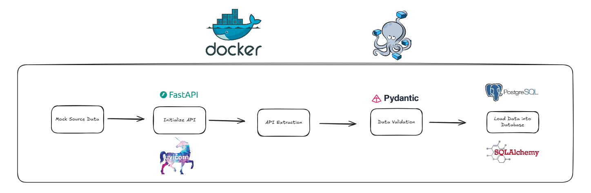

# 🚀 Pipeline ETL - Geração e Ingestão de Dados de Compras 🛍️

[]

Este projeto implementa um **Pipeline ETL (Extração, Transformação e Carga)** que simula a ingestão contínua de grandes volumes de dados de compras gerados por uma API Mock em um banco de dados **PostgreSQL**.

Ele serve como um excelente *playground* para demonstrar proficiência em:

1.  Desenvolvimento de **APIs** com **FastAPI** para simulação de dados.
2.  Orquestração de um processo de **ETL** em Python.
3.  Validação de dados utilizando **Pydantic**.
4.  Uso do **SQLAlchemy** (ORM/Core).
5.  Uso de **Docker** e **Docker Compose** para isolamento e orquestração de microsserviços.

---

## 🎯 Objetivo

O principal objetivo é criar um fluxo de dados confiável e escalável, simulando a chegada de informações transacionais (**compras**) que podem ser usadas posteriormente para análises e relatórios.

## 💡 Arquitetura do Projeto

O pipeline segue um fluxo linear, encapsulado em contêineres Docker para facilitar a execução e garantir um ambiente consistente.

| Etapa | Componente Principal | Tecnologia | Função |
| :---: | :---: | :---: | :---: |
| **Geração** | `fastapi.py`, `fake_generate.py` | **FastAPI**, **Faker**, Uvicorn | Expõe um endpoint que gera **dados de compras *mock*** em tempo real. |
| **Orquestração/Extração** | `main.py`, `APIOrchestrator.py` | Python, `requests` | Orquestra o *polling*, extrai (`GET`) os dados da API em lotes. |
| **Validação/Transformação** | `APIOrchestrator.py` | **Pydantic** | Valida a estrutura e tipos de dados extraídos contra o `CompraSchema`. |
| **Carga** | `APIOrchestrator.py` | **SQLAlchemy**, `psycopg2` | Conecta ao **PostgreSQL** e insere os dados validados na tabela. |
| **Contêineres** | `Dockerfile`, `docker-compose.yml` | **Docker**, **Docker Compose** | Empacota e orquestra o banco de dados, a API e os *workers* ETL. |

---

## 🛠️ Tecnologias Utilizadas

| Categoria | Tecnologia | Uso no Projeto |
| :---: | :---: | :---: |
| **Linguagem** | Python 3.13 | Linguagem principal para ETL e API. |
| **API** | **FastAPI**, **Uvicorn** | Criação da API de Geração de Dados. |
| **Modelagem/Validação** | **Pydantic** | Definição do *Schema* (`CompraSchema`) e validação rigorosa dos dados. |
| **Database** | **PostgreSQL** | Banco de dados relacional para persistência de dados. |
| **ORM/Conexão** | **SQLAlchemy** (Core) | Criação da tabela e inserção eficiente dos registros. |
| **Infraestrutura** | **Docker**, **Docker Compose** | Empacotamento e orquestração dos serviços (DB, API, ETL Worker). |
| **Geração de Dados** | **Faker** (pt\_BR) | Criação de dados de compras realistas em português. |

---

## ⚙️ Como Executar o Projeto (Localmente com Docker)

### Pré-requisitos

Certifique-se de ter o **Docker** instalado em sua máquina.

### 1. Clonar o Repositório

```bash
git clone git@github.com:EriickHenriique/etl_fake_database.git
cd etl_fake_database
```

### 2. Subir os Serviços

O arquivo `docker-compose.yml` define e configura quatro serviços: **postgres**, **pgadmin**, **fastapi** e **etl_worker**.

Execute o comando abaixo na raiz do projeto:

```bash
docker compose up --build
```

#### O que acontece após o comando?

- Os serviços **postgres (DB)** e **fastapi (API Mock)** são iniciados.  
- O serviço **etl_worker** aguarda a inicialização completa do PostgreSQL.  
- O **etl_worker** inicia o script `main.py`, que começa o ciclo de Extração/Validação/Carga:
  - Faz o request para a API do fastapi.
  - Valida os dados com Pydantic.
  - Insere **10.000 linhas** no PostgreSQL por execução.
  - Repete este processo **50 vezes** com um delay de 5 segundos.

Os logs do processo ETL serão exibidos no seu terminal.

---

### 3. Acompanhamento (Opcional)

Você pode inspecionar o banco de dados via **pgAdmin**:

- **URL:** http://localhost:5050  
- **Email:** fake123@gmail.com  
- **Senha:** postgres123  

**Conexão com DB (postgres):**

| Parâmetro | Valor |
|------------|--------|
| Host | postgres |
| Port | 5432 |
| Database | etl_fakedata |
| User | postgres |
| Password | postgres |

A tabela criada será `tabela_compras` dentro do banco `etl_fakedata`.

### 4. Parar e Limpar os Serviços

Para parar e remover os contêineres, redes e volumes:

```bash
docker compose down
```

Para remover **TUDO**, incluindo o volume de dados do banco:

```bash
docker compose down -v
```

---

## 📂 Estrutura de Código

```
etl_fake_database/
│
├── main.py                        # Ponto de entrada do Worker ETL
├── backend/
│   ├── APIOrchestrator.py         # Classe central do ETL (Extração, Validação e Carga)
│   ├── contracts/
│   │   └── contracts.py           # Define o CompraSchema (Pydantic)
│   ├── data/
│   │   └── fake_generate.py       # Lógica de mock de dados (Faker)
│   └── api/
│       └── fastapi.py             # Endpoint /gerar_compra/{param}
├── docker-compose.yml             # Orquestra os serviços (DB, API, ETL Worker)
└── Dockerfile                     # Define o ambiente Python do projeto
```

📘 **Autor:** Erick Henrique  


